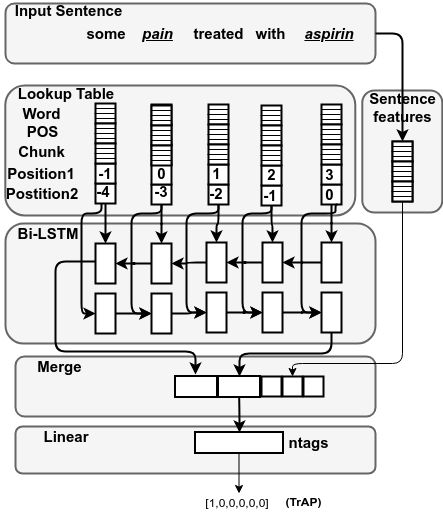

#Bidirectional LSTM for Medical Relation Extraction task

Mining relationships between treatment(s) and medical problem(s) is vital in the biomedical domain. This helps in various applications, such as decision support system, safety surveillance, and new treatment discovery. We build a deep learning approach that utilizes both word level and sentence-level representations to extract the relationships between treatment and problem.

 

See [the paper](https://arxiv.org/pdf/1806.11189.pdf) for more information.

This repository contains python implementations of deep learning using Keras library.

# Source

* `bidirectional_lstm_ner.py`: deep learning code for medical term identification. </br>
* `bidirectional_lstm_rel.py`: deep learning code for relation extraction. </br>
* `lstm_model_creator.py`: Contains methods to create LSTM model.</br>
* `pos_features.py`: Class to get the word level features.</br>
* `preprocessingscript.py`: Preprocesses the CRF features file to matrix format for medical term identification.</br>
* `read_CRFFeaturesFile_i2b22010_rel_onemodel.py`: Reads CRF features file and creates samples for training neural network model.</br>
* `commandline_scripts`: Contains the scripts to run codes for medical term identification and relation extraction. </br>
* `python_notebooks`: Contains all scripts in the python notebook format.</br>
* `data` : Folder contains input and output folders generated by code. </br>

# Runnable scripts:
* `i2b22010_ner.sh`: script to run medical term identification (bidirectional_lstm_ner.py) code.
* `i2b22010_rel.sh`: script to run relation extraction (bidirectional_lstm_rel.py) code.
 
 ```
 python bidirectional_lstm_ner_categorical.py 
 ```
 with attributes, 
 * `--vocab_size`: Maximum number of words in the vocabulary of corpus
 * `--maxlen`: Maximum length of the sentence
 * `--embedding_size`: Word embedding size
 * `--lstm_output_size`: LSTM output dimension size
 * `--num_hidden_layers`: Number of hidden layers
 * `--batch_size`: Traning batch size
 * `--nb_epoch`: Number of epochs
 * `--max_charlen`: Maximum character length of a word
 * `--char_vocab_size`: Total number of unique characters in the corpus
 * `--char_embedding_size`: Character embedding size
 * `--ngram_vocab_file`: Vocabulary file
 * `--word2vecFile`: Pretrained word embeddings
 * `--train_crfFeaturesFile`: Directory containing train documents
 * `--test_crfFeatures_dir`: Directory containing test documents
 * `--output_crfFeatures_dir`: Output Directory to store predictions
 * `--modelfile`: Filename for saved model 
 * `--posfile`: List of POS tags
 * `--chunkfile`: List of chunk tags
 * `--suffile`: File containing list of prefixes
 * `--prefile`: File containing list of prefixes
 * `--cap`: Use capitization features
 * `--pos`: Use POS tags as feature
 * `--chunk`: Use chunk tags as features
 * `--suf`: Use suffix as feature
 * `--pre`: Use prefix as feature

